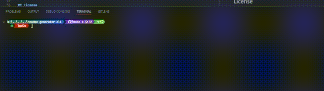
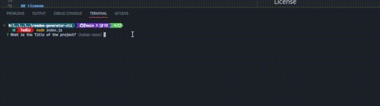
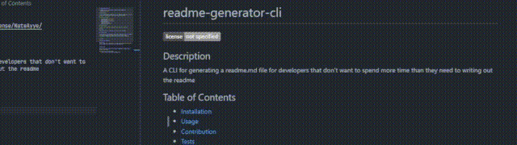

# readme-generator-cli


## Description

A Terminal tool for developers to be able to generate a README.md file for any project by just answering a few questions that the cli will ask you.

## Table of Contents

- [readme-generator-cli](#readme-generator-cli)
  - [Description](#description)
  - [Table of Contents](#table-of-contents)
  - [Installation](#installation)
  - [Usage](#usage)
    - [Example:](#example)
  - [Contribution](#contribution)
  - [Tests](#tests)
  - [License](#license)
  - [Questions](#questions)

## Installation

Run these commands in your terminal to clone the repository locally then cd into the repo and install all its dependencies.

```shell
git clone https://github.com/NateAyye/readme-generator-cli.git`

cd readme-generator-cli

npm install
```

## Usage

Once installed got to the root directory of the repo in the terminal and run

```shell
node index.js
```

You will then be prompted with multiple questions in order to fill out the README.md for you.

### Example:

[&#x21e8; Open Example Video In Browser &#x21e6;](https://drive.google.com/file/d/1uHbQMAFO1AV-0Q8PViWK2oY5R7q4WSqe/view?usp=sharing)



All The prompts





## Contribution

Basic Rules for contributing to this repo are gonna be held to standards with the [Contributor Convenant Code of Conduct](https://www.contributor-covenant.org/version/2/1/code_of_conduct/) Standards.

## Tests

Currently there are no tests.

## License

Refer to the [MIT License](https://github.com/NateAyye/readme-generator-cli/blob/main/LICENSE) file within the root of the repository;

## Questions

Want to know me a little bit bette more? [NateAyye's Profile](https://github.com/NateAyye)

Want to get in contact with me?

- Send an email to nathanacuevas97@gmail.com
